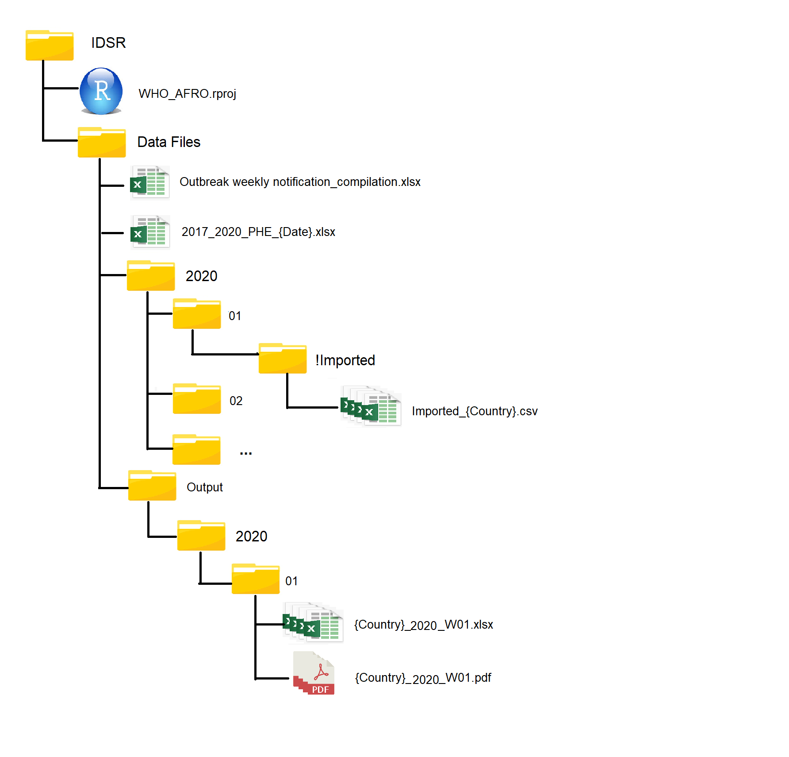
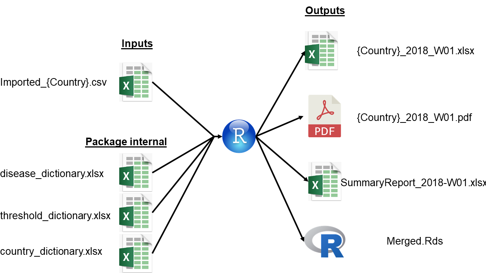

<!-- README.md is generated from README.Rmd. Please edit that file -->

```{r setup, include = FALSE}
knitr::opts_chunk$set(
  collapse = TRUE,
  comment = "#>",
  fig.path = "man/figures/README-",
  out.width = "100%"
)
```

# epichecks

<!-- badges: start -->
[](https://travis-ci.org/R4IDSR/epichecks)
[](https://ci.appveyor.com/project/R4IDSR/epichecks)
[](https://codecov.io/gh/R4IDSR/epichecks?branch=master)
[](https://www.tidyverse.org/lifecycle/#experimental)
[](https://CRAN.R-project.org/package=epichecks)
<!-- badges: end -->

The goal of {epichecks} is to provide functions for simplifying data quality
checks and threshold analyses for IDSR data.
The package further contains helper functions that automate the production of 
feedback documents for countries. 


## Installation

Currently the package is not on CRAN. 
Once it is - you can install the released version of epichecks from [CRAN](https://CRAN.R-project.org) with:

``` r
# install.packages("epichecks")
```

In order to install the package you will first need to install an extra bit of 
software called [Rtools](https://cran.r-project.org/bin/windows/Rtools/).  
You can download the installer from: https://cran.r-project.org/bin/windows/Rtools/  
Please install the version highlighted in green. 

Once this is installed and you have restarted your computer, 
the development version of the package can be installed from [GitHub](https://github.com/) with:

``` r
install.packages("remotes")
remotes::install_github("R4IDSR/epichecks")
```
## Folder set up 

In order for the funtions to work you need to have folders set up correctly. 

Create one main folder, in example called **WHO AFRO**.  
Within this folder create an R project (e.g. **WHO_AFRO.Rproj**) - *remember to open R 
through this project every time - to have the correct root directory*.  
Within the **WHO AFRO** folder have a **Data** folder.  
The **Data** folder contains the *PHE dataset* and a **Processed** folder which in 
turn has a folder for each calendar week.  
Place *IDSR data* for each country as *CSV* files in to the appropriate
calendar week folder.  
Within the **WHO AFRO** folder create an **Outputs** folder, and within that 
a **Verification** folder. The package will create a folder for each calendar week
and place, for each country, an excel with flags and a pdf letter with flags. 

As an example: 



## Weekly Country Feedback 

This section explains how to make weekly feedback for countries based on 
pre-processed IDSR data. 

Open your R project (e.g. **WHO_AFRO.Rproj**) and type the below code.  

This will produce outputs for week 35 of 2018 as an example. 
See ?week_report for details of parameters that can be adjusted. 
*n.b. this can take a couple of minutes to run* 

``` r
library(epichecks)
week_report(current_week = "2018-W35")
```
This function creates an excel (**Country_2018_W35.xlsx**) with two tabs, 
the first flags missing disease counts data and the second flags when disease counts
data exceeds pre-defined thresholds.  
It also creates a pdf letter (**Country_2018_W35.pdf**) which summarises the 
flags in the excel.  
These two files are created for each country.  
  
In addition it creates two files for internal WHO use.  
The first is a summary of countries reporting, with counts of diseases, missings, and 
threshold flags (**SummaryReport_2018_W35.xlsx**).  
The second is an *R* dataset with all the countries for that week combined. (**Merged.Rds**)  

Three dictionaries are included in the {epichecks} package, and used internally for
processing.  
These include country names, disease names and threshold alert definitions. 




Please note that the 'epichecks' project is released with a
[Contributor Code of Conduct](.github/CODE_OF_CONDUCT.md).
By contributing to this project, you agree to abide by its terms.


